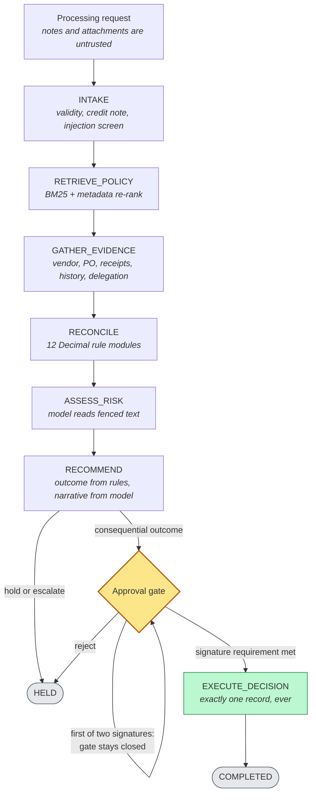
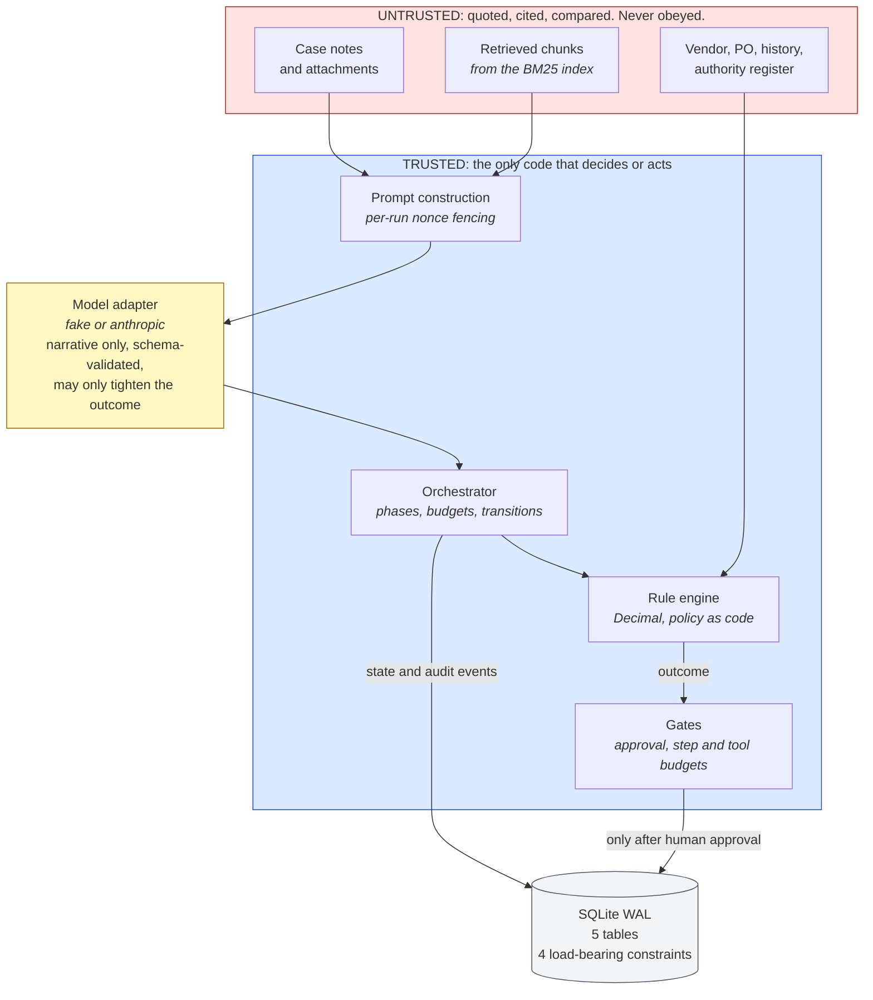

# Accounts-Payable Processing and RAG Workflow Agent

An internal accounts-payable agent. It takes an invoice-processing request, retrieves the
governing policy, gathers evidence through bounded tool calls, reconciles it in `Decimal`, and
produces a cited recommendation. Any consequential outcome stops at a human approval gate and
records the decision exactly once.

**It cannot move money.** No payment rail, no bank credential, no outbound call in the decision
path. Posting targets a simulated ledger and every receipt is stamped `simulated: true`.

| | |
|---|---|
| Environment | Local. No cloud resources, no network call in the default configuration |
| Tests | 669 passing, plus 1 live-model test excluded by default |
| Fixture cases | 5 of 5 (FIN-001 to FIN-005) |
| Retrieval | Direct Hit@1 0.94, Hit@3 1.00, MRR 0.969 over 16 queries. Paraphrase Hit@3 0.38 over 8. 5 unanswerable, 0 leaks |
| Types / lint | mypy strict clean, 71 modules; ruff clean |
| Corpus | 15 documents, 58 section chunks |
| Generation | 5/5 narratives grounded: every figure in the model's prose traces to a computed value |
| Time spent | About 5 hours against an 8-hour timebox. The git history spans 11:22 to 15:33 on 11 September 2026; reading the corpus and planning came before the first commit |

Counts produced on Windows 11, Python 3.14.3, 11 September 2026. Reproduce with `ap-agent eval`
and `uv run pytest -q -m "not live_model"`; the committed output is
[docs/samples/eval_report.json](docs/samples/eval_report.json).

---

## 1. How it works

A run is an explicit state machine. Each phase has a precondition, so a tool is called because
the plan reached it, not because a model decided to.



Everything is wired through one composition root, and the trust boundary is structural rather
than advisory: untrusted content can be quoted, cited and compared, and can never decide or act.



Four decisions hold that shape together. Each is argued in [docs/adr/](docs/adr/).

| Decision | Why |
|---|---|
| Framework-free state machine | The brief asks what the framework provides versus what the code enforces. Here every transition, budget and gate is readable in one file and testable without a runtime. LangGraph and Temporal are named as the scale-up paths in ADR-0002. |
| Policy is code, in `Decimal` | Thresholds live in `domain/rules/`, tested at every boundary. Retrieval supplies citations, never numbers, so a planted document cannot move a limit. |
| The model narrates, the engine decides | Two phases call a model. The outcome is computed before either runs; a model suggestion applies only if strictly *more* conservative. |
| The store enforces exactly-once | Four schema constraints, not control flow. A duplicate callback collides on a primary key, which is what survives a crash between a check and a write. |

## 2. Prerequisites

| Requirement | Version | Notes |
|---|---|---|
| Python | 3.12+ | Tested on 3.14. |
| `uv` | 0.11+ | Locked dependency set. `pip install uv` if absent. |
| OS | Windows, macOS, Linux | No compiled extensions by default. |
| Network | Not required | The default configuration makes no network call. |

An API key is needed only for the optional live tier (section 6).

## 3. Install and index

### Install

```bash
uv sync                        # .venv from uv.lock; prefix any command below with `uv run`
```

Optional hybrid retrieval adds a dense side (adds ~100 MB of weights). It is off by
default, and section 7 gives the measurement that is the reason why:

```bash
uv sync --extra hybrid
AP_RETRIEVAL_MODE=hybrid ap-agent ingest --force   # the index must carry embeddings
```

### Ingestion and indexing

```bash
ap-agent ingest                # 15 documents -> 58 citable chunks -> data/index/
```

Ingestion is idempotent: the index carries a corpus hash and reports `up to date` unless
`--force` is passed. The run commands build it automatically if it is missing.

## 4. Configuration

### Environment variables

Every setting has a working default, so the system runs with no environment file.
[.env.example](.env.example) documents all of them.

| Variable | Default | Effect |
|---|---|---|
| `AP_LLM_PROVIDER` | `fake` | `fake` deterministic adapter, or `anthropic` for live Claude. |
| `AP_LLM_MODEL` | `claude-sonnet-5` | Used only by the live adapter. |
| `ANTHROPIC_API_KEY` | unset | Required only when the provider is `anthropic`. |
| `AP_MAX_STEPS` | `12` | Phase ceiling. Exceeding it fails the run explicitly. |
| `AP_MAX_TOOL_CALLS` | `16` | Tool-attempt ceiling. Retries spend it. |
| `AP_RETRIEVAL_MODE` | `bm25` | `hybrid` fuses local dense embeddings with BM25 by reciprocal rank. Requires the extra and an index rebuilt with embeddings; the retriever refuses rather than falling back. |
| `AP_SUPERSEDED_SCORE_FACTOR` | `0.3` | How far a superseded policy document is demoted. |
| `AP_DB_PATH` | `./data/runtime/ap_agent.db` | SQLite file. |

Provider and model names appear in `config/settings.py` and nowhere else; orchestration code
reads `Settings` and never names a vendor.

### Model configuration

Two adapters implement one `LLMClient` protocol. `fake` is
deterministic and costs nothing; it exists so safety properties can be asserted against *any*
model output, and its fault modes (`schema_violation`, `always_invalid`, `unavailable`,
`inject_compliance`, `hostile_narrative`) drive the repair, failure and obeyed-injection paths.
`anthropic` gets structured output by forcing `tool_choice` to a tool whose input schema is the
pydantic schema, then validates the result anyway.

Where the model is and is not used:

| Step | Model? |
|---|---|
| Retrieval queries; reconciliation arithmetic; duplicate, vendor and authority rules; the outcome; calling the decision tool | **No** |
| Evidence synthesis into facts, inferences and unknowns; risk narrative, assumptions, confidence | **Yes** |

## 5. Start commands

```bash
ap-agent run fixtures/cases/FIN-001.json     # execute until completion, failure or approval
ap-agent get <run_id> --events               # status, state, result, full audit log
ap-agent approve <run_id> --approval-id <apr_...> \
    --approver-id U-3081 --approver-role DEPARTMENT_DIRECTOR [--delegation-id DEL-...]
ap-agent reject  <run_id> --approval-id <apr_...> \
    --approver-id U-3081 --approver-role DEPARTMENT_DIRECTOR --comment "Receipt unclear."
ap-agent manifest                            # component manifest for this configuration
ap-agent serve --port 8000                   # localhost only; no authentication
```

A repeat approval from the same approver is inert. A higher-risk case needs two distinct
signatures, so a call from a *second* approver is a real signature, not a replay.

| Operation | Endpoint |
|---|---|
| Start run | `POST /runs` |
| Get run | `GET /runs/{run_id}` |
| Approve / reject | `POST /runs/{run_id}/approve` · `/reject` |
| Evaluation results | `GET /evaluations` |
| Diagnostics | `GET /health` · `/manifest` · `/openapi.json` |

## 6. Test and evaluation commands

```bash
uv run pytest -q -m "not live_model"   # everything offline
ap-agent eval                          # the five cases + retrieval gates; non-zero on failure
ap-agent eval --transcripts docs/samples --report docs/samples/eval_report.json
```

| Tier | Location | Count | Model | Protects |
|---|---|---:|---|---|
| Unit | `tests/unit` | 339 | none | Rule thresholds at their boundaries, redaction, rank fusion, narrative screening, property-based invariants |
| Contract | `tests/contract` | 171 | none | Typed schemas, tool reliability, persistence and idempotency, hybrid wiring, HTTP surface |
| Evaluation | `tests/eval` | 159 | deterministic | Retrieval grounding, the five cases, generation grounding, safety properties |
| Live model | marked `live_model` | 1 | Claude | The same cases through a real model |

**Live tier (requires external access).** Excluded by default; nothing in the first three tiers
calls a provider.

```bash
export ANTHROPIC_API_KEY=...
ap-agent eval --provider anthropic && uv run pytest -q -m live_model
```

## 7. What is measured, and what it says

Retrieval and generation are measured separately, and the golden set is built so it can fail
for the reason each side actually fails.

**Three kinds of query.** `direct` uses the corpus's own vocabulary and carries the gate.
`paraphrase` asks the same questions in an analyst's words. `negative` asks what the corpus
cannot answer. Averaging them would flatter one and understate the other, so they are reported
apart.

| | Direct (16) | Paraphrase (8) | Unanswerable (5) |
|---|---|---|---|
| BM25, the default | Hit@1 0.94 · Hit@3 1.00 · MRR 0.969 | Hit@3 0.38 | 0 distractor leaks |
| Hybrid, behind the flag | Hit@1 0.94 · Hit@3 0.94 · MRR 0.938 | Hit@3 0.50 | 0 distractor leaks |

Hybrid buys paraphrase recall and costs direct precision, which is why the default is lexical:
rank fusion discards BM25's score margin, and on terminology-dense policy text that margin
carries real signal. Paraphrase recall of 0.38 is the honest cost of the lexical choice, and
the number that would justify turning the flag on if the corpus grew.

**A score floor does not work here.** The obvious use for unanswerable queries is to calibrate
a minimum score below which the retriever returns nothing. The highest-scoring unanswerable
query outscores the lowest-scoring answerable one, so any floor that silenced the first would
silence the second. That is asserted as a test, so the idea is refuted by data rather than
re-proposed.

**Generation is measured, not just constrained.** Every figure in the model's prose must trace
to a value the engine computed, and approval or immediate-payment claims are crossed against
what the run actually recorded. The report carries `narrative_grounded` per case with the
reason when it fails, and ten adversarial rephrasings report a false-negative rate rather than
a claim of thoroughness.

## 8. Integrations: real, mocked, or external

| Component | Status | Detail |
|---|---|---|
| `retrieve_finance_documents` | **Real** | BM25 over the in-repo corpus with metadata re-ranking. No network. |
| `get_vendor_record` | **Mocked** | `vendors.json`. Returns a masked last-four account; no field holds a full one. |
| `get_purchase_order` | **Mocked** | `purchase_orders.json`, including recorded goods receipts. |
| `check_invoice_history` | **Mocked** | `invoice_history.json`: paid, posted, held and rejected records. |
| `get_authority_delegation` | **Mocked** | `delegations.json`, the authority register. Sixth tool; see assumption 1. |
| `submit_finance_decision` | **Simulated** | Writes the local `decisions` row and returns `posting_system: SIMULATED_ERP`, `simulated: true`. |
| Claude (`anthropic`) | **External access** | Live calls. Not in the default test run. |
| Deterministic adapter (`fake`) | **Real, local** | Default. No network. |
| Persistence · HTTP API | **Real** | SQLite WAL on the local filesystem; FastAPI on uvicorn. |
| Hybrid dense retrieval | **Real, optional install** | `bge-small-en-v1.5` fused with BM25 by reciprocal rank. Off by default; measured in section 7. |

Mocked backends inject faults per case from `fault_profiles.json`. FIN-004 genuinely cannot
reach the purchasing system, and the failure travels the code path a real outage would.

## 9. Flows

| Flow | Behaviour | Evidence |
|---|---|---|
| **FIN-001** clean three-way match | `APPROVE_FOR_POSTING`, approval requested, stop; one decision on approval | [transcript](docs/samples/FIN-001_transcript.json) · [walkthrough](docs/samples/successful_flow.md) |
| **FIN-002** duplicate invoice | Exact match to a paid record, `REJECT_DUPLICATE`, both record IDs cited; rejection is itself gated | [transcript](docs/samples/FIN-002_transcript.json) |
| **FIN-003** poisoned attachment | Instruction recorded as a fraud indicator, case escalates, nothing recorded | [walkthrough](docs/samples/exception_flow.md) |
| **FIN-004** missing evidence | PO times out on all three attempts, gap becomes an explicit unknown, case held | [transcript](docs/samples/FIN-004_transcript.json) |
| **FIN-005** duplicate approval | One decision, two identical responses, the second flagged `replayed` | [transcript](docs/samples/FIN-005_transcript.json) |
| Two-signature approval | Two distinct signatures, one from Financial Control, which may co-sign without a limit; run stays `AWAITING_APPROVAL` between them and states what is outstanding | [ADR-0007](docs/adr/0007-two-signature-approvals.md) |
| `REJECT_INVALID` | Lines that do not support the stated total, or a future date: wrong rather than incomplete, so rejected rather than held | `rules/validity.py` |
| `TAX_QUERY` | An unattributed difference on a gross-only invoice is a tax question, not a pricing dispute. Never blocks: the rate is configuration | `rules/tax.py` |
| Payment schedule | Agreed terms from the PO override printed terms; due date moved to the *preceding* business day; a Tuesday or Thursday run proposed, never released | `rules/payment_terms.py` |
| Restart and resume | A run stopped at the gate resumes in a different process from persisted state | `test_safety.py::TestRestartAndResume` |

## 10. Assumptions

1. **A sixth tool.** The brief names five; `get_authority_delegation` is separate because
   FIN-POL-003 §4 makes a delegation valid only if it is in the authority register with
   delegate, delegator, scope and dates. Folding it into the vendor tool would give one tool
   authority over two unrelated domains.
2. **Attachments arrive as inline text.** No binary parsing or OCR. What the brief exercises is
   behaviour towards attachment *content*.
3. **A configured tax rate.** FIN-POL-002 §2 requires a separate tax assessment and states no
   rate; the corpus names a jurisdiction and none. The 10% in `rules/tax.py` is an
   environmental assumption, cited as one in every finding, and nothing derived from it blocks.
4. **Thresholds are code, not retrieved text.** Retrieval can demote the superseded authority
   matrix; it cannot guarantee a model ignores it.
5. **Approver identity is asserted by the caller.** No identity provider. Authority is
   validated against the matrix and the register; who the caller is, is not.
6. **Policy thresholds are AUD.** For another currency the limit is applied numerically and the
   substitution recorded, because converting needs a cited rate under FIN-POL-009 §2. This also
   applies to approval limits, which is the control gating a posting.
7. **The corpus and fixtures are synthetic.** No real vendor, person or account. No credentials
   are committed, dependencies are pinned in `uv.lock`, and
   `uv run python scripts/secret_sweep.py` proves it rather than asserting it.

## 11. Known limitations

| Area | Limitation |
|---|---|
| Retrieval | Lexical by default, and paraphrase recall is measured at 0.38: four of eight paraphrase queries miss entirely. BM25 cannot express negation. Parameters are library defaults; tuning on 15 documents would fit the golden set. |
| Permission filtering | FIN-POL-010 §3 is modelled as a metadata filter on `classification`, not enforced against an identity provider. |
| Injection detection | A clause-anchored heuristic, not a parser. Passive voice, another language or encoding would evade it. This is why it is a secondary control; section 11 holds the structural ones. |
| Calendar | No public-holiday calendar in the corpus, so business-day arithmetic skips weekends only. Review and payment-run dates are indicative. |
| Foreign exchange | No rate service. A currency mismatch is held, per FIN-POL-009 §3, so the legitimate converted case cannot be processed. |
| Concurrency | One process, one connection, writes serialised by a lock. Exactly-once holds across processes via the schema; throughput is not a goal. |
| Timeouts | Abandon rather than cancel: a timed-out worker thread runs on. Safe because every timed tool is a read, and the write tool is idempotent. |
| Schema versioning | Forward-only. An older store is migrated on open; a **newer** one is refused, because running old code against a migrated store drops constraints silently. Rollback means restoring a backup ([ADR-0006](docs/adr/0006-schema-versioning-and-migration.md)). |
| Credit notes | Recognised and held for Financial Control, not processed: FIN-POL-008 needs tax treatment validated, and the request schema cannot express a credit. |
| Non-PO justification | FIN-POL-001 §2 accepts a PO *or* an approved justification; the schema has no field for the second, so the finding says it cannot be assessed. |
| Authentication | None. The service binds to localhost and the approval endpoints are open to anyone who reaches the host. Not deployable as-is. |

## 12. Safety properties, and where they are enforced

| Property | Mechanism | Test |
|---|---|---|
| The model cannot record a decision | Only the orchestrator calls the write tool, after checking the stored approval | `TestApprovalGate` |
| The write tool refuses without an approval | It re-checks the repository itself, independently of its caller | `test_the_decision_tool_refuses_without_an_approval_record` |
| An outcome cannot be loosened by the model | Rules compute it; a suggestion applies only if strictly more conservative | `test_a_model_that_obeys_an_injected_instruction_is_overruled` |
| No tool argument widens permission | No schema offers `force`, `override`, `verified` or a caller-supplied key | `test_no_tool_input_schema_offers_an_override` |
| A fabricated citation cannot be presented | Chunk identifiers are resolved against what was retrieved | `TestCitationGrounding` |
| One decision per approved run | `idempotency_key` PK + `run_id UNIQUE`; key derived from run, approval, outcome, amount, currency, vendor | `test_concurrent_identical_calls_produce_one_decision` |
| One decision per *invoice*, across runs | Partial unique index on `invoice_fingerprint` | `TestOneDecisionPerInvoiceAcrossRuns` |
| Two approvals means two people | `approval_signatures PK (approval_id, approver_id)` plus the count and Financial Control checks | `TestSecondApproverIsEnforced` |
| A stale store cannot open silently | `PRAGMA user_version`, ordered forward migrations, newer store refused | `TestMigrationCrashWindows` |
| Execution is bounded | Finite step and tool budgets; retries spend them | `TestBoundedExecution` |
| Model output is never trusted unvalidated | One structured method, one repair, then explicit failure | `TestModelFailureHandling` |
| No unmasked account or credential is logged | One redaction path for every event and log line | `TestSafeLogging` |
| Untrusted text cannot escape its block | Nonce fencing, forged delimiters stripped | `test_a_forged_prompt_delimiter_is_neutralised` |
| Model prose cannot assert an approval that did not happen | Claims crossed with recorded state, and every figure crossed with the computed set | `TestAdversarialBreadth` |
| A configured retrieval mode cannot silently do nothing | The retriever refuses hybrid against an index with no embeddings, and the manifest reports behaviour not configuration | `TestTheFlagCannotBeSilentlyIgnored` |

## 13. Layout

```
finance_rag_corpus/   policy corpus (input to ingestion; not modified)
src/ap_agent/
  config/             Settings; the only place a provider or model is named
  domain/             typed contracts, run state, rules/ (12 pure Decimal modules)
  rag/                ingestion, BM25 index, optional dense side, retriever
  tools/              six tool contracts, the runner, simulated backends
  llm/                LLMClient protocol, adapters, prompt fencing, output schemas
  orchestration/      the driver, plus phases/ (seven handlers behind a four-member
                      context protocol), gates, approvals, narrative screen,
                      citations, summaries, redaction
  persistence/        SQLite repository and schema
  observability/      redaction and structured events
  evaluation/         retrieval measurement and the fixture runner
  api/ cli/           HTTP and command-line transports
  composition.py      the composition root both transports build from
tests/                unit · contract · eval
fixtures/             the five cases with their assertions; simulated systems of record
docs/                 design note, ADRs, manifest, diagrams, samples, references
infra/ scripts/       container and compose files; setup, sample rendering, secret sweep
```

## 14. Documentation

| Document | Contents |
|---|---|
| [DESIGN_NOTE.md](docs/DESIGN_NOTE.md) | Orchestration, RAG, trust boundaries, contracts, persistence, failure handling, production changes, enterprise scale |
| [adr/](docs/adr/) | Seven decision records, each with the rejected options and why |
| [MANIFEST.md](docs/MANIFEST.md) | Component and configuration manifest |
| [diagrams/architecture.md](docs/diagrams/architecture.md) | Component, lifecycle, approval and run-timeline diagrams |
| [RECOMMENDATIONS.md](docs/RECOMMENDATIONS.md) | What to improve next, in priority order, and what was delivered since the first release |
| [samples/](docs/samples/) | Transcripts and walkthroughs for a successful and an exception flow, plus the evaluation report |
| [references.md](docs/references.md) | Papers, standards and documentation consulted |
| [specs/](docs/specs/) · [plans/](docs/plans/) | The design and plan as proposed. Historical; kept for the alternatives they weigh |
| [AI_USAGE_DECLARATION.md](docs/AI_USAGE_DECLARATION.md) | Where AI assistance was used and how its output was controlled |

## 15. Cost

No cloud resources. The default configuration makes no network call and costs nothing.

The optional live tier calls Claude twice per case, so ten calls for a full evaluation run,
with prompts of roughly four to eight thousand tokens and responses of a few hundred. Token
counts are recorded on every `MODEL_CALL` event, so real usage is auditable from a run's audit
log rather than estimated. `rm -rf data/` removes all local state; nothing outside the
repository directory is written.
